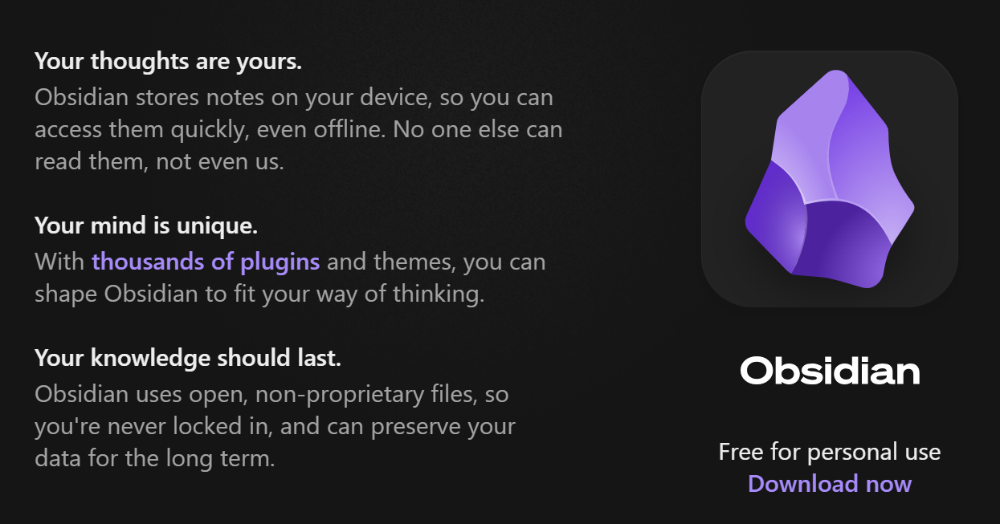
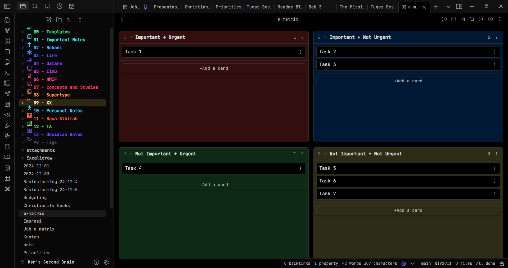
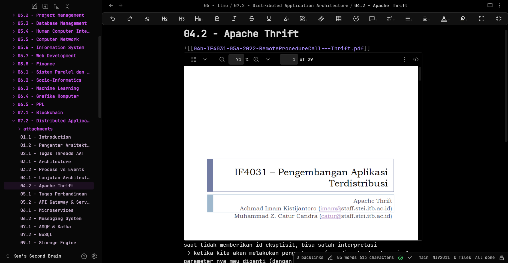
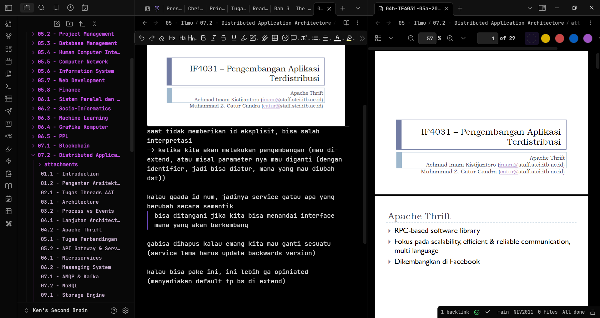
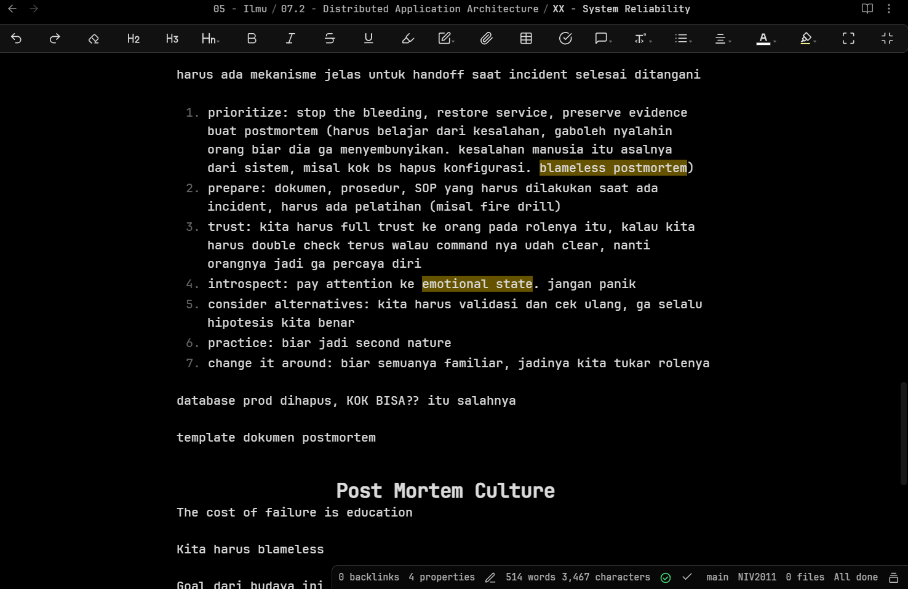
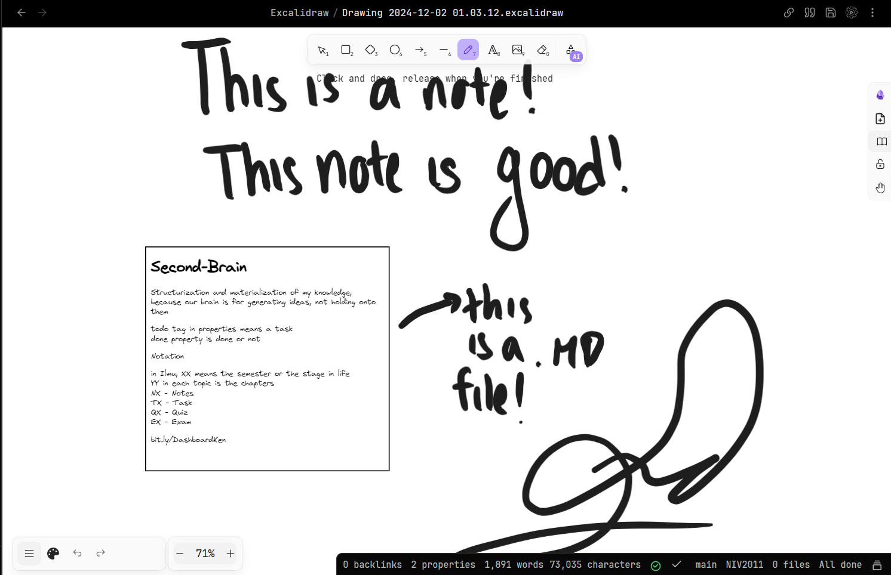
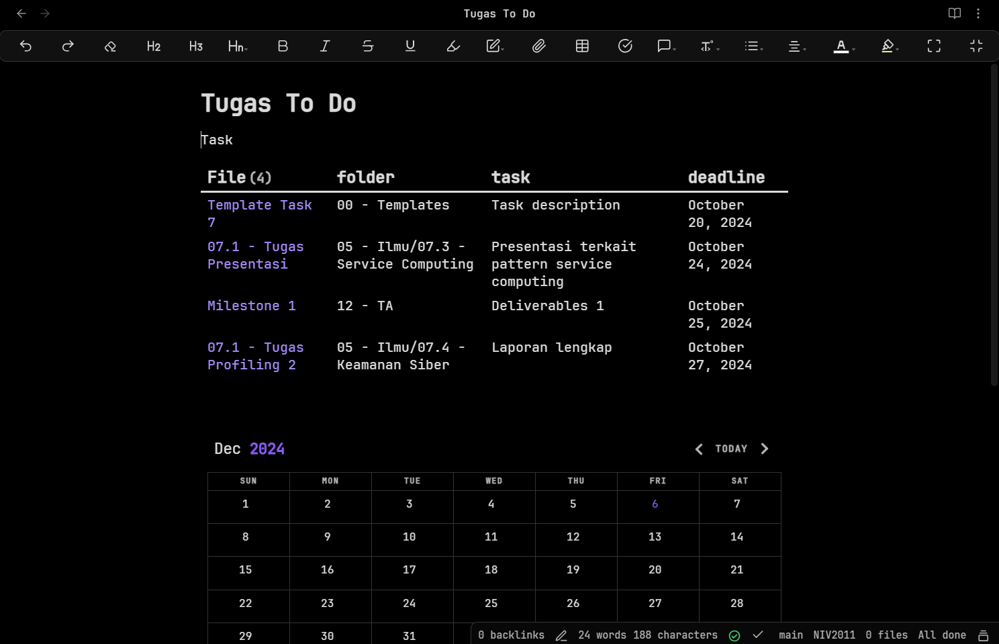
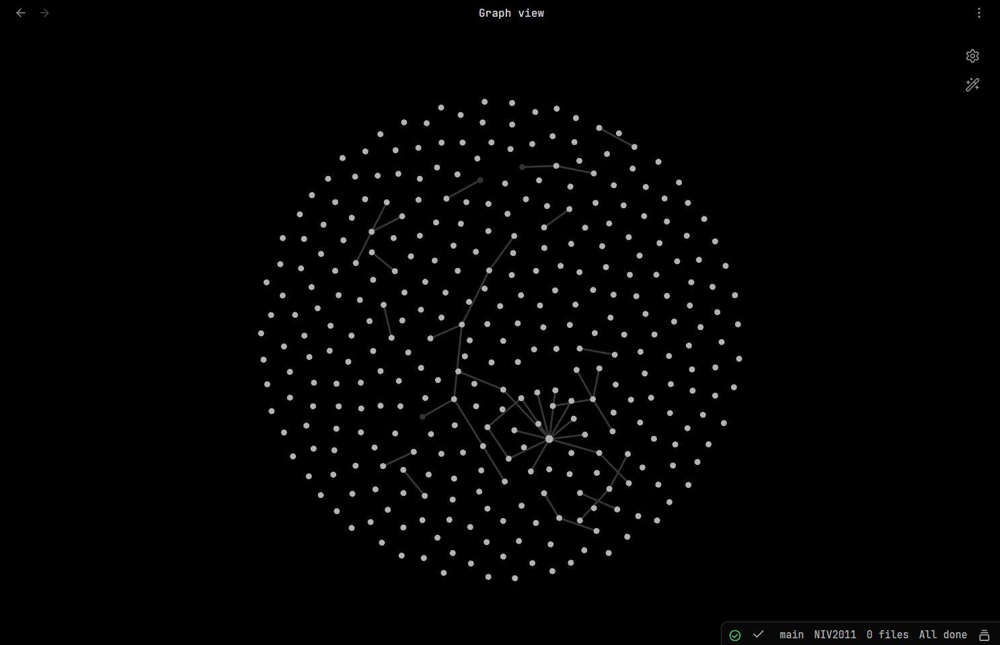
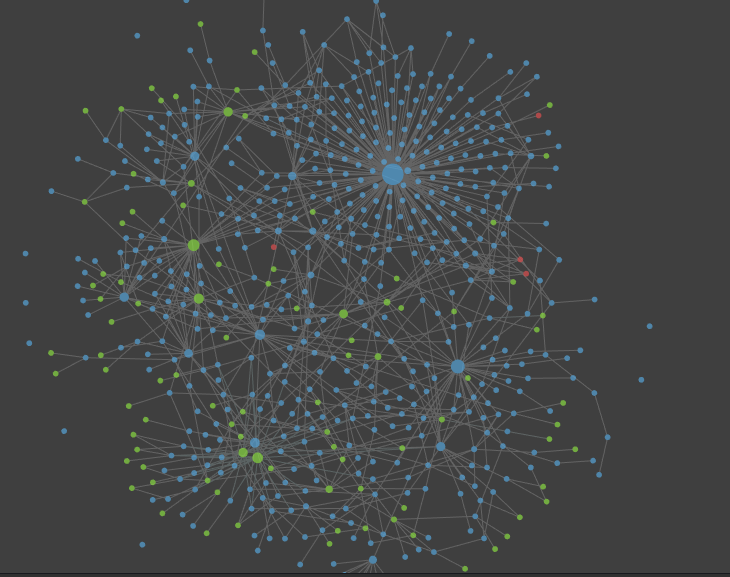

# Obsidian: The Best Lightweight-Customizable Note Taking Software

Obsidian adalah note taking sofware yang ringan, berbasis lokal, dan customizable.

Disini, gua akan bahas gimana cara menggunakannya dengan efisien.

<!-- truncate -->

---
Before we begin, a disclaimer:

**Disclaimer**: This tool is not for everyone, if you don't feel like you like this type of tool, feel free to skip this post. For you who feel like this type of tool might be helpful for you, I will try my best to explain what it is, and provide an easy tutorial. Also, I do not claim to be an expert, I am here to share my findings and hopefully inspire others

---

## What is Obsidian?

Simpelnya, [Obsidian](https://obsidian.md) itu sebuah aplikasi untuk mencatat. Intinya disitu, **note-taking**. Beberapa aplikasi yang mirip dengan Obsidian itu Notion, Evernote, Google Keep, atau bahkan note app yang ada di hp kalian.

Obsidian menyimpan seluruh note kita dalam format `.md` pada *device* kita, jadi kita bisa akses semua file kita, bahkan dalam keadaan offline sekalipun (plus, ga ada yang bisa baca selain kita, karena offline disimpennya, bukan di cloud nya Obsidian). 

## Why Obsidian?

Bedanya apa dengan yang lain?

Paling mudah dijelasinnya dengan kata: **seimbang**. Dibanding Notion, Obsidian itu lebih ringan, tapi dibanding note app, Obsidian itu lebih customizable.

Kalau kalian mirip gua, kalian pasti pernah nyoba-nyoba beberapa note taking app, mau bikin sebuah catatan buat sesuatu yang kalian pikirin atau pelajarin karena kalau ga dicatat pasti lupa. Kalau fisik, nanti catatannya hilang, atau susah bawa-bawa buku kemana-mana.

Personal experience gua saat menggunakan Notion, Notion itu berat, kadang loadingnya lama, sampai bikin gua udah lupa mau nyatet apa. Selain itu, Notion juga nyimpen semuanya di Internet, jadi gua selalu butuh koneksi.

Kalau pakai note app hp atau notepad di laptop, rasanya kurang nyaman, karena berasa *bland* banget, susah ngatur notenya, ga ada fitur apa-apa yang memudahkan.

Uniknya Obsidian adalah banyak banget plugin yang ada di Obsidian. Karena Obsidian free for personal use, community Obsidian sekarang udah lumayan besar. Obsidian itu sangat modifiable, jadi banyak orang dari community obsidian itu membuat *mod* untuk obsidian, yang namanya *community plugins*. Jadi Obsidian itu ga bosenin gitu. Ini contoh Obsidian yang sudah dipasang beberapa *plugins*:

Mirip Notion kan? Yes, tapi spesialnya adalah: *it can almost do everything Notion can do, but it can run it locally, and it is lightweight.* Take my word with a grain of salt, as I have only compare it with my past experience working with a large amount of notes in Notion, tapi gua merasa bahwa lama-kelamaan, ada limit customization di Notion, dan makin banyak di-custom, makin nge-lag.

Other than that, banyak banget fitur *quality-of-life* yang memudahkan banget dan sesuai banget sama kebutuhan gua, contohnya:

1. Embed attachments (image, PDF, etc.) langsung ke dalam note

2. Attachments bisa dibuka langsung di Obsidian

3. Aesthetically pleasing, you can do it your way (ini my kind of aesthetic, font, theme, warna, cara bikin note, cara decorate note, semua customizable)

4. Ada plugin yang sangat keren, contoh: Excalidraw di Obsidian (bahkan di dalam Excalidraw kita bisa embed Notes kita ke dalam drawing kita), ada juga Canvas (ini kita bisa bikin diagram antar note kita), ada juga Dataview (kita bisa QUERY note kita kaya SQL)

5. Ada sebuah view yang bernama **Graph View**, dimana kita bisa lihat semua notes kita seolah itu adalah sebuah graph, dan note kita bisa kita bikin **link ke note lain**, dengan cara bikin `[[nama note lain]]`, yang akan membuat note lain bisa diakses dari note kita (kaya bikin hyperlink), dan di graph view akan langsung muncul

Graph view gua belum rapih, so gua akan kasih contoh graph view orang yang udah rapih

6. Masih banyak, but gabakal beres kalau semuanya disebutin

## Obsidian Drawbacks

Obsidian pun ga terlepas dari kekurangan, ada sebuah kekurangan yang sudah jelas implied karena cara kerja Obsidian, yaitu:

**Gabisa collaborative work**

Yep, kalau kalian mau bikin note yang collaborative, sejauh ini masih belum bisa di Obsidian (ada fitur buat share note kita secara online pakai plugin share note, tapi read-only, atau kita juga bisa export note kita jadi PDF)

Nah, lalu kalau mau multiple device gimana?

Seharusnya itu gabisa, tapi ternyata ada banyak workaround yang bisa diimplement, beberapa contohnya:

- Menggunakan Obsidian Git, jadi note vault kita dijadiin repository Git, ya layaknya repo Git, bisa share antar device jadinya (ini susah kalau mau sync sama hp atau tab, karena keterbatasan Git di device selain pc)
- Menggunakan Cloud Storage, seperti iCloud (sejauh ini gua denger ini paling oke karena paling cepat, tapi ya harus Apple environment), atau Google Drive yang diakses lewat file manager, atau OneDrive (tapi kedua ini lumayan lama syncnya, tapi lebih reliable dibanding Git buat hp dan tab)
- Terakhir, menggunakan **Obsidian Sync**, yaitu opsi berbayar yang disediain oleh tim Obsidian

## Obsidian Sync

Sejujurnya ini buat yang mau aja, karena ga semua orang butuh ini. Tapi menurut gua, ini adalah salah satu investment yang paling worth it buat gua, dengan auto-sync antar sebanyak apapun device, tanpa perlu mikirin gimana.

Kita cuma perlu bayar per bulan, lalu masukin vault kita ke Obsidian Sync kita, beres.

Buat harga, 5 USD per bulan, tapi JANGAN LUPA untuk apply Discount Student 40% cuma dengan buktiin kalau kalian masih mahasiswa aktif, jadi 3 USD per bulan. Kalau kalian mau langganan setahun langsung, dapet 20% off lagi, jadi 28 USD per tahun atau sekitar 2.33 USD per bulan.

## Zettelkasten: Second Brain

Metode [Zettelkasten](https://zettelkasten.de/overview/), atau disebut juga metode *Second Brain* itu berdasar pada teori bahwa otak kita itu Good at coming up with ideas, not keeping them. Kita belajar, dapet informasi baru, tapi kita itu bisa mudah lupa terhadap apa yang sudah kita pelajari. Disini diperkenalkan sebuah metode note taking untuk knowledge management kita, sehingga kita bisa lebih menstrukturisasi pengetahuan yang kita miliki, dan juga bisa lebih mudah recall apa yang sudah kita pelajari.

Banyak [resource](https://obsidian.rocks/getting-started-with-zettelkasten-in-obsidian/) terkait Zettelkasten, dan Obsidian is exceptionally good at making the Zettelkasten, as shown [here](https://forum.obsidian.md/t/setup-zettelkasten-but-how/85224)

## Plugins Recommendation

Banyak banget *community plugins* yang ada, *and believe me, you won't be able to try it all*, kalau kita terlalu banyak download plugins tanpa beneran berguna atau sesuai buat kita, kita bisa bikin Obsidian kita jadi lebih berat, dan juga jadi cluttered banget, jadi *keep it simple, stupid!*

With that in mind, ada beberapa plugins yang bisa gua rekomendasikan, tapi tetep liat dulu, sesuai ga sama kebutuhan kalian?

1. Almost all core plugins itu essential, jadi liat aja di bagian core plugins, mana yang kalian ga butuh, nonaktifin, sisanya coba pelajari untuk dipakai
2. Advanced Tables - membantu banget buat markdown table
3. Dataview - Query note kaya SQL
4. Editing toolbar - self-explanatory
5. Excalidraw - pretty self-explanatory
6. Kanban - buat bikin kanban board, cocok buat personal tasks/project tasks
7. Git - self-explanatory
8. Recent files - self-explanatory
9. Tasks - bantu banget kalau kita pakai Obsidian buat catet tasks kita, karena bisa set deadline, kalau kita checklist itu langsung muncul kapannya, dst
10. Share notes - share note kita di host di cloud nya share note

## Learning Resources

- [Full Obsidian Guide](https://youtu.be/hSTy_BInQs8?si=QKXp3vVYTpKNzrV_) - menurut gua ini lumayan lengkap dan prinsip nya gua setuju karena ini simpel dan ngebantu kita setup dengan seminimal mungkin
- [Aesthetics](https://youtu.be/rAkerV8rlow?si=h4S3XCG_QUKljn-V) - ini guide terkait aesthetic yang sangat inspiring, banyak banget yang gua pake dari resources dia, dan keren banget
- [Hack Your Brain with Obsidian](https://youtu.be/DbsAQSIKQXk?si=IpTK1NlnryPHGvNw) - penjelasannya bagus, workflownya dapet
- Many more in the Obsidian Forum, Reddit, Youtube, etc.

Akhir kata, there's a world to explore here on Obsidian, I hope this post taught you something.